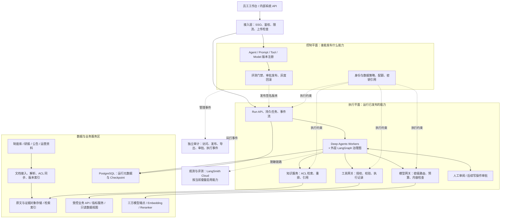
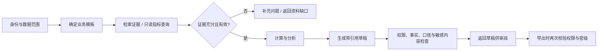

# 金融企业 Agent 平台架构蓝图

版本：v0.2 · 设计日期：2026-09-12 · 状态：详细设计输入，待 P0 门禁通过后进入试点

已确认范围：金融机构私有化部署；首期服务内部知识、投研与运营辅助。当前使用阿里云 OSS、OpenAI 兼容三方模型和 LangSmith Cloud；没有 LangSmith Enterprise，不建设自建 Agent 可观测体系。并发量、数据规模、现有基础设施、商业预算和适用监管辖区尚未确定。下文中的服务拆分、验收目标和排期均为建议，不是产品能力承诺或已完成的性能测试。本文新增的 P0 门禁未通过前，只允许合成数据或已批准的低敏数据进行 PoC，不能据此批准金融生产运行。

## 0. P0 立项与试点门禁

本节优先级高于后文的路线、目标和排期。每个门禁需要有责任人、证据位置、批准日期和失效条件；未通过即保持 R0/R1 草稿能力，不开放业务写入、对外发送或高密级数据。

| 门禁 | 必须冻结/完成的内容 | 通过证据 |
|---|---|---|
| 部署与出网 | 在完全隔离、VPC 受控出网、混合外部模型三种模式中选择一种；记录模型、OSS、LangSmith、更新介质、DNS 和 egress 路径 | 数据流清单、供应商审查、驻留/删除验证、硬性 allow/deny 规则、kill switch 演练 |
| 监管与数据 | 确认司法辖区、牌照/内部政策、研究记录与 MNPI 边界、个人信息、留存和法律冻结责任人 | 法务/风险/数据所有者签署的控制映射与数据资产/ACL/许可清单 |
| 供应商与模型 | 三方模型、Embedding、Reranker、OCR、评测服务逐项完成地域、留存、训练使用、合同和安全审查 | 供应商白名单、模型 profile、数据处理矩阵、版本和变更审批 |
| 凭据与仓库 | 轮换当前环境中的 API/云凭据；使用 Vault/KMS/STS/工作负载身份；仓库忽略规则和提交前/CI secret scanner 生效 | 轮换回执、扫描报告、日志/镜像/备份排查记录 |
| 纵向切片 | 单域、单数据源、单制度问答模板先跑通接入→ACL→Deep Agent→引用→审阅→导出→审计 | 撤权、删除、失效资料、恢复、提示注入、越权和人工接管演练记录 |
| 质量与 SLO | 冻结黄金集、样本量、切片、阻断项、置信区间、延迟负载配置和责任人 | LangSmith 数据集/实验、签字阈值、失败处理和回滚记录 |

### 部署与出网决策

| 模式 | 允许的数据路径 | 硬门禁 |
|---|---|---|
| A 完全隔离 | 内部模型、Embedding、OCR、OSS 内网端点；升级使用签名介质；LangSmith Cloud tracing 禁用 | 无公网 DNS/出口；镜像 SBOM 与签名；恢复介质演练；观测缺失时不得假称已观测 |
| B VPC 受控出网（PoC 候选） | 通过 egress proxy 访问批准的三方模型和 LangSmith Cloud；仅发送矩阵允许的脱敏低敏字段 | 域名/证书 allowlist、DLP、地域/留存审查、每租户路由、请求限额和 kill switch；高密级原文默认拒绝 |
| C 混合模型 | 按字段和密级选择内部或三方模型，保留人工/内部模型 fallback | 数据类别→供应商/模型→租户授权三重匹配；fallback 不得自动越权；供应商变更重新评测 |

首期建议只在模式 B 做低敏 PoC；是否允许生产数据发送到 LangSmith Cloud 和三方模型，必须由机构政策与供应商审查决定。不能通过修改 `.env` 切换生产模式。

## 1. 核心设计决定

建设一个由统一身份、数据权限和版本治理支撑的 Agent 平台。Deep Agents 作为首选 Agent harness，LangChain 提供模型与工具集成，LangGraph 承担外层有状态治理编排；企业治理、检索权限、业务执行边界与审计由独立的平台能力负责。

- **平台管理与任务执行分离。** 管理端发布不可变的 Agent 版本；运行端只执行获准版本。普通使用者不能上传任意代码或动态安装工具。
- **确定性流程包围有限自主决策。** 权限、数据密级、额度和发布规则由代码或策略引擎判定；模型在获准工具和步骤预算内选择检索、分析与组织答案的方法。
- **首期做三个可评测的业务模板。** 制度知识问答、投研资料分析、运营异常分析与处理草稿。首期输出为内部草稿，业务写入和对外发送随后逐项开放。
- **知识和计算走不同路径。** 文档检索提供证据；财务指标通过受控数据接口和确定性计算生成；模型负责解释。
- **安全能力跨越整个执行链。** 用户输入、检索片段、工具返回、模型上下文、运行记录、导出文件都进入相同的数据分类和访问控制体系。
- **逻辑职责清晰，物理部署克制。** 首期允许管理模块共用服务，优先复用机构已有 IAM、Kubernetes、数据库、日志和密钥系统。

LangChain 当前的 `create_agent` 基于 LangGraph 构建，提供模型、工具、结构化输出与中间件机制；Deep Agents 在其上提供规划、文件/上下文管理、子 Agent 和人工介入。业务模板优先使用 `create_deep_agent`，需要显式分支、并行分析和审批节点时，在外层定义 LangGraph 图。[LangChain Agents](https://docs.langchain.com/oss/python/langchain/agents)

## 2. 总体逻辑架构



图中是逻辑边界，并不要求每个方框独立成一个微服务。审计与权限覆盖全部组件；业务数据库不对 Agent Worker 开放通用写权限。

| 组成 | 平台需要提供的能力 | 关键边界 |
|---|---|---|
| 员工工作台 | 应用目录、对话、附件、任务进度、引用跳转、草稿编辑、审阅、导出、反馈 | 只展示用户当前可访问的任务和资料；服务端重新鉴权 |
| 平台管理 | 项目与角色、模板配置、版本、工具目录、知识库、模型配额、发布、评测、审计检索 | 平台管理员、发布人、业务审阅人职责分离；管理员默认不拥有业务正文阅读权限 |
| Run 服务 | 创建任务、异步队列、状态查询、事件流、取消、恢复、定时任务入口 | 每个任务有所有者、空间、版本、预算、期限和可追踪事件 |
| Agent Runtime | 图执行、子任务、状态保存、错误分支、有限重试、人工中断 | 可调用的模型与工具来自已发布策略；拒绝任意网络、Shell 和数据库连接 |
| 知识服务 | 内容接入、权限同步、时间过滤、混合检索、重排、引用证据 | 检索结果进入模型前完成权限过滤；源权限失效时及时撤回 |
| 工具网关 | 工具注册、参数校验、身份委托、限流、沙箱、执行确认 | 模型只产生调用提议；授权和副作用控制在服务端完成 |
| 模型网关 | 统一接口、模型白名单、密级路由、容量调度、成本归集、输入输出治理 | 当前三方模型通过固定 profile 接入；未来私有模型可替换，所有模型服从相同边界 |
| 观测与审计 | LangSmith Cloud 调试链路与评测；独立审计证据 | LangSmith 仅接收允许的脱敏字段；关键审计事件必须持久保存，二者权限与保留期分开 |

## 3. LangChain 生态如何组合

| 组件 | 建议定位 | 平台仍需负责 |
|---|---|---|
| LangChain | 模型/工具适配、基础 Agent、结构化输出、中间件、检索组件 | 业务授权、金融计算口径、数据分类、服务治理 |
| LangGraph | 显式状态图、条件分支、子图、任务恢复、人工中断 | 运行调度、线程访问鉴权、业务幂等、审批身份与期限 |
| LangGraph Checkpointer / Store | Checkpointer 存会话运行状态；Store 存经允许的跨会话信息 | 数据分区、删除、保留策略、加密、备份；生产不能依赖内存存储 |
| LangSmith | 唯一 Agent 观测与评测入口：Trace、数据集、实验对比、可用的离线/在线评测 | 业务审计记录、领域标准答案、发布责任人和机构治理流程；Enterprise 专属能力不作为依赖 |
| MCP 适配 | 按需接入通过审查的工具服务器 | 逐工具权限、凭据委托、网络隔离、版本审查；协议接入不代表工具可信 |
| Deep Agents | 首选 Agent harness：规划、文件产物、上下文管理、子 Agent 与 HITL | 权限隔离、沙箱、预算、工具网关和输出验收仍由平台负责 |

Deep Agents 在 LangChain / LangGraph 之上提供文件和上下文管理、子 Agent、规划与人工介入能力。本方案优先用 `create_deep_agent` 构建首期助手；只有需要严格顺序、审批、幂等和不可跳过的状态转换时，才在外层增加自定义 LangGraph 节点。[Deep Agents overview](https://docs.langchain.com/oss/python/deepagents/overview)

MCP 接入封装在独立适配层并锁定版本。当前官方文档提供基于 FastMCP 的 `langchain.mcp`，同时标注该接口处于 beta；详细设计应验证所选版本并隔离接口变更，避免将适配库直接暴露给业务模板。[LangChain MCP](https://docs.langchain.com/oss/python/langchain/mcp)

Checkpointer 和 Store 的职责不同，生产应选持久后端；LangGraph 官方 Agent Server 可管理持久化，但直接使用开源库时需要自行配置。[LangGraph Persistence](https://docs.langchain.com/oss/python/langgraph/persistence)

**私有化有两条部署路线，必须在立项时区分：**

| 路线 | 组成 | 适用取舍 |
|---|---|---|
| A：开源运行内核，自建平台服务 | Deep Agents + LangChain/LangGraph + 自建 Run API/Worker；自管持久状态与调度；Agent 观测和评测统一使用 LangSmith Cloud | 平台控制力强；任务生命周期和运维仍需投入研发，不建设第二套 Trace/评测体系 |
| B：采购自托管产品能力 | LangSmith 私有化；按需包含 Agent Server / Deployment；企业平台集成其运行接口 | 减少运行管理与评测平台的自研工作；需核实许可、资源依赖和隔离部署支持 |

**推荐：业务治理层自建；Agent 运行层采用 Deep Agents + LangGraph；所有 Agent 观测和评测直接使用 LangSmith Cloud。** 当前无 Enterprise 时，先按实际 Developer/Plus 账户能力运行，不能依赖 Enterprise 的自托管、定制 SSO/ABAC、支持 SLA 或专属部署能力。若采用 LangSmith Deployment 管理运行，Run API 保留业务鉴权与接口适配，运行状态、线程与持久化由一个权威系统管理，避免同时维护两套调度器。

路线切换以新运行迁移为主：旧版本运行排空或在原运行系统完成，审批中的任务保留原归属。预先验证代码/配置、数据集、评测结果和审计证据的导出；不假设两个运行系统的 Checkpoint 可直接互换，不允许同一 Run 被两套系统同时驱动。

LangSmith 自托管目前属于 Enterprise 计划的附加能力；独立 Agent Server 的官方生产部署需要提供许可证。非 air-gapped 模式需向 `beacon.langchain.com` 出网以完成许可验证与用量上报，完全隔离部署需与供应商确认离线许可及支持配置。不能把“自托管”视为默认断网可用或免费。[Self-hosted LangSmith](https://docs.langchain.com/langsmith/self-hosted)；[Self-host standalone servers](https://docs.langchain.com/langsmith/deploy-standalone-server)；[Self-hosted egress](https://docs.langchain.com/langsmith/self-host-egress)

## 4. 三个首期业务模板

| 场景 | 建议流程 | 交付结果 | 主要验收点 |
|---|---|---|---|
| 制度知识助手 | 识别问题 → 业务域/有效日期 → ACL 检索 → 证据校验 → 回答或澄清 | 有原文位置、版本与生效日期的回答 | 引用支持结论；不引用已失效制度；证据不足时说明缺口 |
| 投研助手 | 明确标的/期间/口径 → 资料与指标并行获取 → 确定性计算 → 分析草稿 → 事实核验 → 人工审阅 | 财务比较、材料摘要、研究草稿及证据包 | 币种、单位、会计期间一致；区分事实与推断；资料具备许可 |
| 运营助手 | 收集异常 → 只读查询 → 规则匹配 → 原因与处理建议 → 草稿审阅 | 异常说明、核对清单、工单草稿 | 不改账、不自动触达客户；每条建议能关联查询结果 |

业务模板采用“Deep Agent harness + 外层治理图”。Deep Agent 负责规划、文件/上下文管理和必要的子 Agent；外层 LangGraph 固定身份注入、资料授权、审批、预算、恢复和结束条件。投研可并行使用资料检索、财务分析、事件梳理等受控子任务，设置最大并发、节点次数、工具次数、Token 和总时长。只有在权限隔离、任务独立或评测结果证明有收益时才增加多 Agent。

LangGraph 同时支持预定义工作流和动态 Agent；具体组合取决于任务可预测性。[Workflows and agents](https://docs.langchain.com/oss/python/langgraph/workflows-agents)



简单知识问答无需每次进入双人审批；需要正式发布的研究材料沿用机构现有审核流程。审阅状态和允许的导出格式由模板策略规定。

## 5. RAG 与金融数据设计

### 接入与证据

文档接入链路为：源连接器 → 文件与恶意内容检查 → OCR/版面/表格解析 → 文档分类与 ACL 映射 → 结构化分块 → Embedding 与关键词索引 → 质量检查 → 发布索引版本。

每份文档与片段至少保留：`document_id`、版本、来源、原文位置、所属空间、ACL 引用、密级、发布日期、生效区间、采集时间、内容哈希、解析与索引版本、许可使用范围。表格保留表头、单位、页码与脚注；图片与 OCR 保留原图定位。

区分三类时间：**业务所属期间、资料对外可知时间、平台采集时间。** 回答“截至某日”的问题时按当时可得资料检索，避免把之后发布的财报或制度用于历史判断。行情与指标结果携带来源及时间戳，按业务配置过期阈值。

### 权限与检索

- 服务端由受验证的身份创建只读运行上下文；`tenant_id`、空间、用户和数据范围不能取自模型生成参数。部门权限来自当前 IAM/ACL，不能让模型修改图状态扩大权限。
- 在关键词和向量检索阶段执行 ACL 与时间过滤，候选内容在进入重排、模型上下文前完成授权校验。不能只在生成后删除敏感答案。
- 权限撤销、文件删除或资料许可到期，需要撤回索引并失效缓存；权限同步延迟期间，对敏感源实时复核或暂拒检索。命中标题、摘要、计数和引用预览同样可能泄露信息。
- 每个数据源上线前约定 ACL 撤权传播上限、授权状态有效期、缓存 TTL、索引更新频率及告警责任人；敏感源授权状态过期或同步失败即拒绝访问。验收覆盖撤权后的检索、历史上下文、引用和导出。
- 摘要、会话记忆、Checkpoint 中的证据和生成材料继承来源限制，记录来源依赖与密级。恢复历史任务、重新展示或导出时复核当前权限；已经失权的片段不能继续进入模型上下文，相关派生摘要须移除或基于仍获授权的材料重新生成。跨部门分享按接收者与来源权限交集判断。
- 缓存键包含空间、授权范围/权限版本、语料版本及模型配置；命中后仍检查当前权限。默认不跨用户共享语义答案缓存。
- 默认采用关键词 + 向量混合召回，再按业务进行重排。机构名称、证券代码、条款号、时间与财务单位需要专门评测。达到规模或语言效果瓶颈时再引入专用搜索/向量服务。
- 引用由服务端绑定真实的文档和片段标识，模型不能自行编造 URL。证据包记录本次实际使用的资料及其版本；来源冲突和缺失应在回答中显式呈现。

### 文档、计算和记忆

金额、收益率、汇率、同比/环比、估值等通过审核过的指标服务和计算函数获得，统一币种、单位、时区、交易日历、复权及舍入规则。SQL 能力若后续开放，放到只读副本或受控视图，限制查询类型、行数、耗时、扫描量和字段范围，禁用任意数据库访问。

Checkpoint、跨会话记忆和正式知识库分开管理。首期默认只保存任务必需状态；长期记忆按用户/空间显式开启，只接受可验证、有来源和有效期的数据。聊天内容不能未经审查自动升级为全员共享知识，模型推断不能直接写成客户事实。

## 6. 工具、安全与业务动作

工具注册项包含：所有者、版本、输入输出 Schema、读写性质、允许角色、数据密级、网络目的地、超时、速率、资源限制、是否可重试、幂等能力、审批策略和审计字段。工具描述、MCP 服务元数据、依赖包和自定义代码均经过审查，生产只加载固定版本。

身份由企业 SSO 接入，网关实施 RBAC + 资源属性策略。每次工具调用仍验证当前用户、服务身份与资源权限；服务间使用短时凭据，长期密钥存入企业密钥系统。若接入远程 HTTP MCP，应按适用协议版本验证令牌的目标资源与受众，禁止直接透传上游令牌；stdio 工具通过进程隔离与受控环境管理凭据。[MCP Authorization](https://modelcontextprotocol.io/specification/2025-11-25/basic/authorization)

**权限和工具清单是执行控制，不是提示词约定。** 文档、网页、邮件、附件和工具输出都作为不可信数据处理；其中的指令不能升级为系统指令。注入检测只能作为辅助，真正的约束来自网关授权、数据隔离、出网限制及受限执行环境。

| 动作等级（本方案内部分类） | 示例 | 控制方式 |
|---|---|---|
| R0：只读 | 检索制度、查询指标、读取工单 | 正常授权、访问审计、配额与字段限制 |
| R1：生成材料 | 投研草稿、核对表、内部导出 | 内容与引用检查；按模板要求审阅；导出再鉴权并记录材料版本 |
| R2：业务写入（后续） | 创建工单、更新业务记录、发送通知 | 明确展示实际参数；业务策略和人工批准；幂等与结果确认 |
| R3：重大金融动作（后续独立评审） | 资金、交易、授信等 | 独立风险评审与职责分离；最终执行仍由授权业务系统负责 |

风险等级由工具注册和上下文共同决定，模型不能降低等级。R3 不是首期能力，不能通过增加一个 Prompt 就开放。

**后续引入写操作时采用以下协议：**

1. 生成动作提议，标准化工具参数；展示对象、影响、材料和可验证依据。
2. 策略预检并创建持久审批单；绑定参数哈希、相关版本、数据快照/资源版本、有效期与审批人。参数改变后重新评估并审批。
3. 审批期间暂停运行且释放 Worker；审批回调验证审批人身份与职责，执行前重新核验授权、资源状态和资料新鲜度。关键变化使原审批失效。
4. 审批消耗和执行意图入库采用事务与唯一约束；同一审批单只能被一个执行意图消费，并发请求使用版本校验。持久 outbox 将意图交给执行器，重放沿用同一业务幂等键；下游支持时传递该键，并保存下游操作 ID。
5. 超时或连接中断后标记 `UNKNOWN`，先查询回执或对账；不可判定时转人工处理。仅凭本地幂等表不能保证外部系统绝不重复执行。
6. 明确成功、失败、取消、审批拒绝、审批过期和待确认状态；业务补偿走独立受控动作。取消请求不能撤销已发生的外部副作用。

LangGraph 中断恢复会重新执行中断节点起始处的代码，所以审批前节点不能混入不可重复的业务写入。持久 Checkpoint 提供恢复基础，不等于跨系统事务或 exactly-once。[LangGraph Interrupts](https://docs.langchain.com/oss/python/langgraph/interrupts)

## 7. 模型与输出治理

当前环境已经配置 OpenAI 兼容的三方模型端点和 `k3` 模型，因此“私有模型为默认”是目标路线而不是现状。生产应由模型网关统一接入该三方端点，并把供应商、端点、模型、地域、留存承诺、数据密级、限额和脱敏策略纳入版本化配置。私有生成模型、Embedding、重排、OCR 和评测模型均可后续替换为机构内服务；在此之前不把三方响应直接暴露给业务代码。

模型网关负责模型/适配器白名单、密级和数据驻留路由、请求并发、上下文长度、Token 预算、超时、限流及熔断。当前三方端点只允许通过固定 egress allowlist 访问，并按公开/内部/机密/受监管分类决定是否可以发送；高密级和受监管数据默认拒绝发送，除非完成供应商、地域、留存、合同和脱敏审查。降级模型必须提前通过相同业务与数据策略评测，不能仅通过修改 `.env` 在供应商之间切换。

分类/抽取任务可使用较小模型，复杂分析使用经评测的更强模型。接口兼容并不代表工具调用、结构化输出和流式事件完全兼容，模型升级前运行契约与业务回归测试。

财务事实、计算结果与模型推断在输出结构中分开记录；事实绑定证据，计算绑定输入和函数版本。格式正确不代表内容正确，仍需规则检查和业务评测。

敏感内容检查必须位于用户可见输出之前。普通问答可采用经检查的分段流式输出；高密级材料和正式报告先缓冲完成检查再交付。连接断开只改变交付状态，运行是否继续由明确策略决定。

## 8. 部署、存储与可靠性

### 建议的首期技术组合

下表为候选实现，优先替换为机构已经批准和运维的同类组件；具体版本、许可与兼容性在详细设计时锁定。

| 范围 | 建议基线 | 何时扩展 |
|---|---|---|
| 工作台/管理端 | React + TypeScript，统一接入企业门户和 SSO | 再按岗位增加工作区和配置界面 |
| 平台 API | Python + FastAPI；采用商业运行服务时保留鉴权适配层 | 按负载和团队职责拆分服务 |
| Agent | Deep Agents（基于 LangGraph）作为首选 harness，LangChain 提供模型与工具适配 | 按业务密级、模型等待和资源耗用拆 Worker 池；高风险步骤由外层 LangGraph 固定 |
| 状态与元数据 | PostgreSQL；逻辑区分平台表、运行状态和业务执行台账 | 容量或隔离要求触发独立数据库/实例 |
| 任务调度（路线 A） | PostgreSQL 持久任务表、租约、重试与 outbox；可复用现有可靠消息设施 | 大吞吐或事件订阅需求时接企业消息平台 |
| 缓存与限流 | Redis，可丢失数据用途 | 不把 Redis 缓存当唯一审批或审计存储 |
| 知识索引 | PostgreSQL + pgvector 起步；关键词检索先选可满足中文金融评测的现有引擎 | 混合检索效果/性能不达标时增加 OpenSearch 或专用向量库 |
| 文件与证据 | 企业 S3 兼容对象存储，版本管理和分级加密 | 审计归档启用机构认可的不可变保留能力 |
| 模型服务 | 模型网关接入 OpenAI 兼容的三方端点；私有模型作为后续可插拔路由 | 端点、模型、地域、留存和限额纳入供应商配置与 AgentVersion；GPU 仅在引入私有模型后估算 |
| 观测 | 统一使用 LangSmith Cloud 的 Trace、数据集和评测界面 | 按 Developer/Plus 当前套餐核对额度与可用功能；不依赖 Enterprise 专属能力，也不建设替代 Trace/评测体系 |
| 身份/策略/密钥 | 既有 IAM、策略服务和 KMS/Vault 类设施 | OPA 等策略引擎按机构标准选用 |
| 交付 | 企业 Kubernetes、内部镜像仓库、CI/CD、GitOps | 使用机构已有审计、签名和漏洞管理流程 |

### 网络与隔离

划分接入区、应用运行区、模型计算区、数据区和管理区。开发、测试、生产隔离；生产数据不默认复制到测试环境。Worker 只访问模型网关、知识服务和工具网关的获准端点；工具连接器才有其负责业务系统的访问权。文档解析和代码计算放入无特权、资源受限、默认无网络的沙箱。

单机构内以业务空间隔离，数据库行策略、对象访问控制、检索过滤、密钥权限和审计查询共同生效。Kubernetes Namespace 或向量库 namespace 本身不能视为完整安全隔离；高密级业务可独立实例/集群与密钥。

### 根据当前环境配置的调整

当前 `.env` 显示使用阿里云 OSS 北京区域，并同时配置公网与内网端点；内网端点开关目前为关闭状态。生产若运行在阿里云 VPC，应切换内网端点并禁止不必要的公网出口。OSS 的建议分工如下：

| 数据类型 | 首选位置 | 需要保留在数据库中的索引/元数据 |
|---|---|---|
| 原始文档、附件、OCR 中间文件、解析大对象 | 私有 OSS bucket | 对象 URI、租户/空间、密级、ACL 引用、版本、哈希、来源与生命周期 |
| 运行元数据、任务状态、审批、策略、版本 | PostgreSQL | 事务状态、唯一约束、审计关联和检索索引 |
| LangGraph Checkpoint | PostgreSQL 为权威存储；超大 payload 可外置 OSS | `thread_id`、checkpoint 版本、对象 URI、完整性哈希与访问策略 |
| 生成报告、证据包、导出文件 | OSS 版本对象 | 内容哈希、生成版本、来源依赖、审阅人和导出权限 |
| 向量/关键词索引 | 从 PostgreSQL/检索引擎按规模选择 | 索引版本、文档片段 ID、ACL 版本和构建状态 |
| 审计归档与备份 | 独立 OSS bucket/存储账号 | 事件序号、完整性信息、保留策略与恢复清单 |

所有对象 key 包含租户、业务空间、密级、资源类型和版本；bucket 禁止公开访问，开启服务端/KMS 加密、版本控制、生命周期和访问日志。下载采用短时签名 URL，签发和访问都再次校验权限。OSS 不能单独承担审批事务或关键审计的唯一副本，跨可用区/地域备份和恢复目标需要实测确认。

当前环境还配置了第三方 OpenAI 兼容模型端点、`k3` 模型和 Daytona 开发沙箱。模型网关应从配置中心读取供应商 profile，不能让业务代码或用户直接拼接 endpoint；Daytona 仅作为开发/受限计算沙箱，生产连接器仍须经过工具网关、网络策略和资源配额。

当前 `.env` 的 LangSmith tracing 开关为开启状态。由于没有 LangSmith Enterprise 私有部署，统一使用 LangSmith Cloud 的观测与评测能力；开发和生产都必须先配置脱敏字段白名单，不发送 Prompt、附件、检索正文和完整工具响应。生产是否发送脱敏 Trace 取决于机构数据出境与供应商审查；若不允许发送，则关闭生产 tracing，但不另建一套 Agent 观测系统。LangSmith Cloud 的 Developer/Plus 额度、保留期、评测和部署功能按当前账户实测，Enterprise 专属能力不写入首期依赖。[LangSmith pricing](https://www.langchain.com/pricing)

`.env` 是未跟踪文件，但包含多项 API 和云访问凭据变量；不要将其复制到文档、日志、镜像或提交记录。立即轮换现有凭据，迁移至 Vault/KMS/Secret Manager 与短期 STS/工作负载身份，并在仓库增加 `.env` 忽略规则和 CI secret scanner。本文只记录配置类别，不记录任何凭据值。

### 运行语义

路线 A 的 Run 服务用持久任务记录和租约驱动 Worker，采用至少一次投递。对同一会话的冲突运行串行化或显式拒绝；租约超时需有 fencing/版本校验，防止旧 Worker 继续提交状态。恢复测试覆盖重复消息、进程崩溃和网络中断。

每个运行固定代码/图、Prompt、工具、模型配置、检索索引和策略评估记录。新部署只改变新运行的默认版本；已暂停运行恢复原版本，或走显式迁移及重新审批。历史可追溯不等于模型再次生成完全一致，关键证据保存实际输入引用、工具结果与最终产物。

待处理状态可采用 `QUEUED → RUNNING → SUCCEEDED / FAILED / CANCELLED`；人工环节进入 `WAITING_REVIEW`，外部结果不明进入 `UNKNOWN`。Run 服务与图执行状态需有明确映射和恢复协调机制，不能假设不同存储操作天然原子。

长投研任务使用异步提交和可重连事件流，返回 `run_id`，支持断点查询和结果获取。交互任务与批量接入/评测任务分开配额，防止一个团队耗尽推理容量。

### 灾备与降级

API 与 Worker 跨可用区冗余，数据库/对象存储/索引按企业标准备份。恢复范围包含 Checkpoint、审批、执行台账、原文证据、权限与发布版本；不能只备份向量库。恢复后先核对待执行意图与下游状态，再开放写能力。

身份或策略校验不可用时，拒绝敏感数据访问和业务写入；不得放宽权限降级。LangSmith Cloud 不可用时，低风险问答可以继续但不展示“已观测”状态；关键审计事件仍写入独立持久记录，否则阻止受控导出/写入。提供按 Agent、模型、工具和业务空间停用的开关。

## 9. 平台核心对象与接口

| 对象 | 关键内容 |
|---|---|
| Workspace | 机构/业务域、数据范围、角色、资源配额、密级策略 |
| AgentVersion | 代码/图摘要、Prompt、工具清单、模型配置、语料策略、评测报告、发布人 |
| Thread / Run | 所有者、空间、固定版本、状态、预算、期限、Checkpoint 与 Trace 引用 |
| Document / Evidence | 来源、版本、ACL、生效时间、引用位置、内容摘要、许可范围 |
| Review / Approval | 审阅对象、内容或参数哈希、相关版本、身份、决定、有效期、使用状态 |
| ToolExecution | 执行意图、幂等键、下游操作 ID、请求摘要、结果/UNKNOWN、对账状态 |
| AuditEvent | 操作者、时间、资源、动作、策略决定、关联 Run、内容摘要、完整性信息 |
| EvaluationSuite | 业务样本、切片标签、数据版本、评判规则、人工标注、运行结果 |

面向业务方统一提供 `POST /runs`、`GET /runs/{id}`、`GET /runs/{id}/events`、`POST /runs/{id}/cancel`、`POST /reviews/{id}/decisions` 和受控材料下载接口。接口中的资源 ID 只是定位符，每次读取、恢复、取消、审阅、导出都验证所有权和当前权限；不能因为知道 `thread_id` 就允许访问会话。

审计保存可核验的输入/输出摘要、资料引用、工具参数摘要、计算版本、策略和人工决定；按需保存加密原文并设细分访问权限。只记录简洁的决策说明和证据，不要求模型提供或保存隐藏思维链。

Trace 采集默认仅允许明确列出的元数据字段，禁止原始 Prompt、附件、检索正文、工具完整响应和密钥进入调试链路；确需正文排障时走受控临时采集、脱敏与单独授权。脱敏失败就丢弃该正文负载，保留错误事件。检查 SDK 自动采集、错误日志、APM、评测样本和前端埋点，确保它们也遵循相同策略，私有化部署不豁免这些要求。

## 10. 评测、发布和验收

上线前固定一套业务专家参与标注的数据集，覆盖正常问题、无答案、冲突资料、失效版本、表格/OCR、错误财务口径、越权尝试、提示注入、模型拒答和工具异常。按场景与数据密级分别统计，防止总体平均分掩盖关键错误。

| 维度 | 测量方法 | 发布要求建议 |
|---|---|---|
| 业务质量 | 专家评分、任务完成率、草稿采纳与修改情况 | 与现有人工/搜索流程对比；阈值由业务负责人签定 |
| 证据 | 引用可解析、支持结论、版本/时间正确；抽样人工复核 | 无来源结论不得伪装成已验证事实 |
| 数值 | 与权威指标服务和固定样例比较，覆盖币种/期间/舍入 | 关键计算回归必须通过；不可只靠模型裁判 |
| 权限 | 跨用户/空间、撤权缓存、任务 ID 枚举、导出、日志访问攻击集 | 门禁样例不得出现越权结果；不能将测试通过等同于绝对安全 |
| 安全 | 文档注入、工具诱导、凭据索取、沙箱逃逸面检查 | 发现可重现的越权或数据泄露即阻断发布 |
| 恢复 | Worker 强杀、重复任务、审批期间发布、下游超时 | 不绕过审批；不盲目重试未知副作用；状态可解释 |
| 性能与成本 | P50/P95 首次可见响应、完成耗时、排队、工具延迟、Token 和 GPU 时间 | 分业务设预算与超时，并验证满载行为 |

LangSmith 提供数据集、人工/代码/模型等评测方式及离线、在线评测。平台应将生产失败经脱敏和授权纳入回归集，形成“样本 → 评测 → 发布 → 抽检 → 修复”的闭环。[LangSmith Evaluation](https://docs.langchain.com/langsmith/evaluation)

发布流程：提交签名制品 → 依赖与安全检查 → 契约/业务/恢复测试 → 数据与业务负责人审阅 → 小范围灰度 → 全量；代码、Prompt、模型、工具 Schema、检索策略和知识版本的变更均进入对应回归门禁。生产反馈先进入待审数据集，不能直接在线改写生产 Prompt 或自动训练。

**供压测讨论的初始目标，不是容量承诺：** 普通知识问答月度可用性 99.9%；正常负载下 P95 完整回答 20 秒以内；复杂投研异步提交 2 秒内确认接收。可用性统计应包含模型和知识依赖，延迟明确是否含排队、上下文长度与输出长度；人工等待另行统计。RPO ≤ 15 分钟、RTO ≤ 4 小时可作为首期讨论值，待机构业务影响分析确定。审计和关键执行记录可能要求更严格的目标。

正式验收前固定负载配置：问答/投研比例、请求到达分布、并发、附件和上下文规模、输出 Token 范围、冷/热缓存比例；分别统计排队、检索、模型和交付检查耗时。未冻结负载配置前，不将上述讨论值写成对外 SLA。

容量按业务分布测算：同时活跃运行约为到达率 × 平均运行时长；推理需求再按每次运行的模型调用数、输入/输出 Token、并行子任务、突发系数与实际模型吞吐计算。无这些数据前不承诺 GPU 数量或固定吞吐。

治理清单可参考 NIST 的生成式 AI 风险管理资料，但它是风险管理依据，不能作为本系统满足具体金融法规的证明。详细设计阶段将适用辖区、机构牌照、数据留存、供应商要求和模型风险制度映射到控制项与责任人。[NIST Generative AI Profile](https://www.nist.gov/publications/artificial-intelligence-risk-management-framework-generative-artificial-intelligence)

## 11. 分阶段落地

以下为在已有基础设施、数据授权可获得、专职跨职能团队可用前提下的参考排期；硬件/采购/数据治理可能成为关键路径。

| 阶段 | 时间参考 | 交付物 | 退出条件 |
|---|---|---|---|
| 0：边界与验证 | 第 1–2 周 | 三场景需求、数据源/权限地图、模型小样评测、部署路线与威胁模型 | 明确业务负责人、数据所有者、评测标准与成本约束 |
| 1：知识助手试点 | 第 3–6 周 | SSO、工作台、RAG、引用、LangGraph 持久运行、基础观测与审计 | 授权/撤权、无答案、引用与恢复用例通过；小群体试用 |
| 2：投研与运营 | 第 7–10 周 | 指标工具、投研并行子图、运营草稿、材料审阅、数据集与发布门禁 | 三场景业务验收；财务口径回归、资源预算和质量基线建立 |
| 3：生产加固 | 第 11–14 周 | 隔离策略、备份恢复、压测、红队用例、灰度回滚、告警与值班手册 | 安全/运维/业务联合验收并完成恢复演练 |
| 4：受控扩展 | 后续按项目 | 工单写入、更多工具/数据源、复杂投研、可配置模板 | 每个新增权限与写动作单独通过风险、审批和幂等验收 |

首期可以从五组部署单元起步：平台 API、Agent Worker、知识接入/检索、工具网关/连接器、模型网关/推理服务；同组内按隔离和资源需求拆进程。发布/评测任务独立运行，不挤占线上交互配额。完整可视化编排器、开放工具市场、任意代码 Agent 和全自动交易平台均放在业务需求得到验证之后。

平台团队负责运行内核、身份与 LangSmith 集成；业务团队负责模板、数据口径与评测样本验收；数据所有者负责权限与资料生命周期；安全/风险负责控制基线；运维负责容量、恢复与值班。每个 Agent 都要有明确的业务负责人和停用责任人。

## 12. 进入详细设计前需要冻结的输入

1. 首批部门、用户数量、峰值请求、任务时长和首要场景优先级。
2. 制度/研报/公告/指标/运营系统名单、接口成熟度、ACL 来源、资料许可和更新频率。
3. 私有部署是否完全断网，已有 GPU、推理平台、数据库、搜索、IAM、Kubernetes 与审计设施。
4. LangSmith 采购意向，以及平台自研、私有模型、运营维护的年度预算。
5. 适用辖区、机构类型、数据密级、保留期、恢复目标及内部模型风险审批流程。

这份蓝图可以直接用于下一轮产出：服务接口与数据模型详细设计、网络与权限矩阵、三条 LangGraph 业务流程、评测集定义，以及按实测负载编制的资源与成本清单。

## 13. v0.2 详细设计闭环（覆盖前文原则性描述）

### 13.1 运行状态、Checkpoint 与外部执行

下表定义一个 Run 的唯一写入权威。PostgreSQL 的 `run` 表是对外状态权威；LangGraph Checkpoint 保存图内部恢复点；`approval` 保存人工决定；`outbox` 保存待发送执行意图；`tool_execution` 保存下游操作与回执；AuditEvent 只追加，不参与业务状态裁决。一个 Run 只能由当前 `worker_epoch` 持有者提交状态，不能由客户端或模型写状态。

| 当前状态 | 允许的下一状态 | 进入条件 |
|---|---|---|
| `QUEUED` | `RUNNING`、`CANCELLED` | 任务幂等键创建成功，Worker 获取租约 |
| `RUNNING` | `WAITING_REVIEW`、`SUCCEEDED`、`FAILED`、`CANCELLED`、`UNKNOWN` | 图节点返回、策略中断、取消或超时 |
| `WAITING_REVIEW` | `RUNNING`、`CANCELLED`、`FAILED` | 审批一次性消费且版本/权限仍匹配 |
| `UNKNOWN` | `RUNNING`、`SUCCEEDED`、`FAILED`、`WAITING_REVIEW` | 查询下游回执或人工对账后决定 |
| 终态 | 无 | 只允许写入补充审计或对账信息，不允许重开原 Run |

状态迁移使用 `run.version` 的 compare-and-set；租约续期和提交都携带 `worker_epoch`，旧 Worker 提交必须失败。Checkpoint 的 `graph_revision`、`AgentVersion`、策略版本和 Run context 摘要必须与 Run 匹配。客户端重试 `POST /runs` 使用业务 `Idempotency-Key`，同键同请求返回原 Run，不同请求返回冲突。

必须验证的恢复矩阵包括：Worker 强杀、数据库提交后进程崩溃、outbox 投递前崩溃、下游已执行但本地超时、审批期间版本发布、权限撤销、重复消息、租约过期和 LangSmith Cloud 不可用。任何外部副作用均先写执行意图；恢复时先查 `tool_execution.operation_id` 或下游回执，不盲目重放。

### 13.2 可重现性、权限快照与 lineage

`AgentVersion` 必须不可变地绑定：代码/图摘要、Prompt 模板、模型与 Endpoint profile、工具 Schema/连接器版本、策略版本、IAM/ACL 快照 ID、语料 manifest、索引版本、行情/汇率/指标快照、计算函数版本和评测实验 ID。历史投研 Run 还要记录业务所属期间、资料可知时间和实际输入引用，证明没有读取未来资料。

lineage 使用以下链路并写入对象/数据库元数据：

```text
来源文档版本 / 指标快照
  → 解析对象 / chunk / 索引版本
  → ACL 过滤结果
  → Deep Agent 输入引用
  → 模型/工具结果
  → 计算函数与参数
  → 草稿 / 审阅 / 导出对象
```

删除或撤回采用 tombstone → 停止新检索 → 索引和缓存失效 → OSS 对象版本处理 → Checkpoint/摘要/记忆清理 → LangSmith Cloud Trace 删除或确认不含原文 → 评测集和备份按策略处理。每一步有删除任务 ID、计数、失败重试和完成证明；删除动作本身进入审计。法律冻结或合规保留的审计对象只限制业务可见性，不绕过 WORM；删除任务记录保留依赖和冻结原因。

### 13.3 审计不可篡改与 LangSmith Trace 分层

关键发布、导出、审批、权限变更、工具执行、UNKNOWN 和人工接管事件写入机构批准的 append-only/WORM 存储，使用可信时钟、事件序号、前一事件哈希/签名、跨区域副本和管理员双人控制。恢复演练要验证哈希链、序号缺口、WORM 保留、备份恢复和访问记录。保留期、legal hold、密钥轮换和分区按机构政策配置。

LangSmith Cloud 只承担 Agent 调试 Trace 和评测，不承担金融审计。Trace 默认字段白名单为 `run_id`、版本摘要、延迟、Token/成本摘要、策略结果和脱敏错误码；原始 Prompt、附件、检索片段、完整工具响应、账户标识和隐藏推理禁止发送。LangSmith 套餐不支持所需删除或驻留证明时，生产 Trace 必须关闭，不以自建观测体系替代。

### 13.4 全链路模型与数据处理矩阵

模型网关维护一张按阶段的策略表，每行包含：数据类型/密级、是否 PII/原文、处理位置与地域、允许供应商/模型、加密与脱敏方式、缓存/保留期、删除触发器和责任人。至少覆盖以下路径，并覆盖 fallback、评测裁判、OCR、索引构建、日志、备份和导出：

| 阶段 | 首期默认策略 |
|---|---|
| 上传/解析/OCR | 原文进入受控 OSS；高密级只允许内部解析；恶意压缩包和宏文件拒绝 |
| 分块/Embedding/索引 | 使用授权后的 chunk；默认内部处理；向量和索引继承 ACL 与删除 lineage |
| 检索/重排 | 先做用户 ACL、有效期和数据新鲜度过滤，再进入重排；禁止通过排序器外发敏感片段 |
| Prompt/生成 | 高密级只允许内部模型；三方模型仅接收矩阵允许的脱敏摘要 |
| 工具返回/输出检查 | 视为不可信输入；经过授权、DLP、引用和格式检查后才可展示/导出 |
| LangSmith Trace | 只发送脱敏 metadata；Cloud 数据位置和留存按账户计划核验 |
| 导出/备份 | 加密 OSS 对象、短时 URL、每次重鉴权；备份保持同等密级和删除策略 |

### 13.5 Deep Agents、MCP 与 Daytona 边界

首期允许使用 Deep Agent，但采用受限 profile：禁用任意 Shell、宿主文件、长期记忆写入和任意 URL；文件工具只能访问本 Run 的隔离工作区，工具只能来自已注册 allowlist。子 Agent 继承父 Run 的 `tenant/user/scope`、模型路由和预算，不能自行提升身份、密级或工具权限。

每个 Run 的初始资源上限作为可调配置并进入 AgentVersion，例如 2 vCPU、4 GiB 内存、2 GiB 工作区、15 分钟墙钟、最多 4 层子 Agent、最多 32 个子任务；正式数值由纵向切片压测确认。默认无出网；网络只经工具网关和固定 DNS/域名 allowlist。每个镜像固定 digest，生成制品先做病毒、敏感信息、公式注入和格式检查，软件制品需有 SBOM、签名和漏洞处置 SLA。

MCP 服务器必须登记所有者、固定版本、工具 Schema、权限和目的地；HTTP MCP 经过代理并校验 token audience、tenant、scope 和过期时间，stdio MCP 使用进程隔离和受控环境变量。工具描述和返回内容都不可信，不能修改工具清单。Daytona 只作为开发/受限代码沙箱，不持有生产业务凭据。

### 13.6 API 语义

`POST /runs` 必须携带 `Idempotency-Key`、`agent_version`（或明确的发布别名）、输入数据引用和客户端超时；返回 `202 + run_id + status_url`。`GET /runs/{id}` 返回状态、版本、预算和最新 `state_version`；更新、取消和审阅使用 `If-Match`/版本号，版本冲突返回 `409`。

`GET /runs/{id}/events` 返回单调递增的 `event_seq`、`event_id`、类型、时间和脱敏 payload，支持 `after_seq` 游标、分页和断线重连；客户端按 `event_id` 去重。审批接口同时需要 `approval_id`、决定的参数哈希和一次性 `Idempotency-Key`，重复审批不会再次消费。取消只阻止尚未发生的步骤，执行中的外部副作用进入 `UNKNOWN` 或回执流程。

### 13.7 重排后的交付路线

前文的通用排期由以下门禁路线覆盖：

1. **阶段 0：治理冻结。** 完成部署/出网模式、监管映射、数据处理矩阵、凭据轮换、`.gitignore` 与 secret scanner、审计/WORM 方案和 LangSmith Cloud 数据审查。
2. **阶段 1：单域纵向切片。** 只选一个制度域、一个数据源、一个制度问答模板，使用受限 Deep Agent 跑通接入、ACL、引用、撤权、删除、恢复、LangSmith Trace 和审计。
3. **阶段 2：只读扩展。** 通过客观黄金集和 LangSmith 实验后，复制到一个投研模板和一个运营草稿模板；任何越权、失效资料命中、指标不一致或恢复不确定都阻断扩展。
4. **阶段 3：生产准入。** 仅在法务/风险/数据所有者/安全/运维联合签署后，进入批准数据范围；冻结 SLO workload profile、样本量、阈值、置信区间、阻断项和责任人。
5. **阶段 4：写操作。** 每个工具独立风险评估，完成职责分离、审批一次性消费、CAS/fencing、outbox、幂等、UNKNOWN 对账、灰度和停用演练后再启用。

在阶段 0–3 未完成前，平台只能处理合成或批准的低敏数据，保持 R0/R1 草稿能力。阶段 1 的退出证据是可重复的撤权、删除 lineage、恢复、引用和审计演练，而不是服务已经部署。

### 13.8 其余生产边界

- **Tenant/Workspace 定义。** Tenant 是机构法人与合同边界；Workspace 是租户内的业务域和资料授权边界。跨 Workspace 分享默认拒绝，只能通过带接收者、来源权限交集、有效期和水印的复制流程。Break-glass 需要双人批准、短时权限、原因、范围和完整审计，不能读取超出批准范围的历史 Trace。
- **人工审阅。** 申请人不能审批自己的动作；冲突、委派、超时、撤回和版本变化均使审批回到 `WAITING_REVIEW` 或失效。审阅界面展示数据快照、参数哈希、资料版本和新鲜度，决定提交后不可覆盖，只能追加纠正事件。
- **保留矩阵。** 为原文、Embedding、摘要、Checkpoint、草稿、导出、LangSmith Trace、审计、备份分别定义保留期、删除触发器、legal hold、访问角色和责任人；删除/撤回任务要能查询每个 lineage 节点的状态。
- **交付安全。** 下载响应禁用浏览器缓存，使用短时 URL、密级标签和水印；CSV/表格导出做公式注入检查。上传拒绝恶意压缩包、宏和超限文件；Markdown/HTML/PDF 预览做 XSS/内容隔离。前端不缓存高密级正文。
- **成本与价值。** 每个 Run 记录模型、Token、工具、并发、沙箱和 LangSmith 用量，按租户/Workspace 设预算与告警。业务价值同时记录人工基线、草稿采纳率、修改时长、节省时长和错误返工，不用“调用次数”代表收益。
